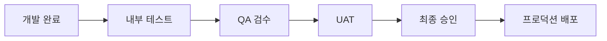

# ✅ 검수 기준 (Acceptance Criteria)
**두리무역 디지털 전환 플랫폼**

문서 버전: v1.0  
작성일: 2025-01-27  
작성자: QA 팀 & 프로젝트 관리팀  
기반문서: 07_REQUIREMENTS.md, 13_TEST_PLAN.md

---

## 📑 목차
1. [검수 개요](#1-검수-개요)
2. [기능별 검수 기준](#2-기능별-검수-기준)
3. [비기능 검수 기준](#3-비기능-검수-기준)
4. [서비스별 상세 기준](#4-서비스별-상세-기준)
5. [출시 준비 체크리스트](#5-출시-준비-체크리스트)
6. [검수 프로세스](#6-검수-프로세스)

---

## 1. 검수 개요

### 1.1 검수 목적
- 모든 요구사항이 충족되었는지 확인
- 품질 기준을 만족하는지 검증
- 프로덕션 배포 준비 상태 확인
- 사용자 경험 품질 보증

### 1.2 검수 원칙
1. **완전성**: 모든 기능이 구현되었는가
2. **정확성**: 기능이 올바르게 동작하는가
3. **사용성**: 사용자가 쉽게 사용할 수 있는가
4. **성능**: 응답 속도가 적절한가
5. **안정성**: 오류 없이 안정적으로 동작하는가

### 1.3 검수 레벨
| 레벨 | 설명 | 통과 기준 |
|------|------|-----------|
| P0 | 핵심 기능 | 100% 통과 필수 |
| P1 | 주요 기능 | 95% 이상 통과 |
| P2 | 부가 기능 | 90% 이상 통과 |
| P3 | 개선 사항 | 80% 이상 통과 |

---

## 2. 기능별 검수 기준

### 2.1 사용자 인증 및 권한

#### AC-AUTH-001: 회원가입
```
GIVEN 신규 사용자가 회원가입 페이지에 접속했을 때
WHEN 필수 정보를 모두 입력하고 제출하면
THEN 
  - 계정이 생성되고
  - 확인 이메일이 발송되며
  - 승인 대기 상태가 된다
```

**체크리스트:**
- [ ] 이메일 중복 검사 작동
- [ ] 비밀번호 강도 검증 (8자 이상, 특수문자 포함)
- [ ] 회사명 한글/중문 모두 입력
- [ ] 역할 선택 정확성
- [ ] 이메일 발송 확인
- [ ] 에러 메시지 명확성

#### AC-AUTH-002: 로그인
```
GIVEN 등록된 사용자가 로그인 페이지에 있을 때
WHEN 올바른 인증 정보를 입력하면
THEN
  - 역할에 맞는 대시보드로 이동하고
  - 세션이 생성되며
  - 권한에 맞는 메뉴가 표시된다
```

**체크리스트:**
- [ ] 이메일/비밀번호 로그인
- [ ] OAuth 로그인 (구글, 카카오)
- [ ] MFA 인증 (설정된 경우)
- [ ] 자동 로그인 기능
- [ ] 비밀번호 찾기
- [ ] 로그인 실패 처리

### 2.2 검품 서비스 신청

#### AC-APP-001: 신규 신청
```
GIVEN 고객이 신규 신청 페이지에 있을 때
WHEN 검품 서비스를 선택하고 정보를 입력하면
THEN
  - 예약번호가 자동 생성되고 (DL-YYYYMMDD-XXXXXX)
  - 중국 직원에게 자동 배정되며
  - 확인 이메일이 발송된다
```

**체크리스트:**
- [ ] 7가지 서비스 타입 선택 가능
- [ ] 필수 필드 검증
- [ ] 파일 업로드 (최대 5개, 각 1GB)
- [ ] 예약번호 형식 검증
- [ ] 자동 직원 배정 알고리즘
- [ ] 이메일 알림 발송

#### AC-APP-002: 견적 및 결제
```
GIVEN 신청이 접수되었을 때
WHEN 중국 직원이 견적을 작성하면
THEN
  - 고객에게 견적서가 전송되고
  - 결제 기한이 설정되며
  - 결제 완료 시 상태가 변경된다
```

**체크리스트:**
- [ ] 견적 금액 자동 계산
- [ ] 마진 정보 숨김 처리
- [ ] 결제 기한 자동 설정
- [ ] 결제 상태 실시간 업데이트
- [ ] 타임아웃 시 자동 취소

### 2.3 실시간 채팅

#### AC-CHAT-001: 메시지 전송
```
GIVEN 채팅방에 참여자가 있을 때
WHEN 메시지를 전송하면
THEN
  - 실시간으로 전달되고
  - 자동 번역이 수행되며
  - 각 사용자는 자신의 언어로 본다
```

**체크리스트:**
- [ ] 실시간 메시지 전송 (1초 이내)
- [ ] 한중 자동 번역 정확도 (95% 이상)
- [ ] 파일 첨부 기능
- [ ] 메시지 삭제/수정
- [ ] 읽음 표시
- [ ] 오프라인 메시지 저장

#### AC-CHAT-002: 게스트 접속
```
GIVEN 중국 직원이 게스트 URL을 생성했을 때
WHEN 공장/검품원이 URL로 접속하면
THEN
  - 로그인 없이 채팅 참여 가능하고
  - 제한된 권한으로 접근하며
  - 세션 종료 시 접근이 차단된다
```

**체크리스트:**
- [ ] 고유 URL 생성
- [ ] 비밀번호 보호
- [ ] 권한 제한 확인
- [ ] 세션 만료 처리
- [ ] 재접속 방지

---

## 3. 비기능 검수 기준

### 3.1 성능 기준

#### 응답 시간
| 작업 | 목표 | 최대 허용 |
|------|------|-----------|
| 페이지 로드 | < 2초 | 3초 |
| API 응답 | < 500ms | 1초 |
| 채팅 전송 | < 100ms | 500ms |
| 파일 업로드 (100MB) | < 30초 | 60초 |
| 검색 결과 | < 1초 | 2초 |

#### 동시 사용자
- 목표: 1,000명 동시 접속
- 최소: 500명 동시 접속
- 채팅: 방당 50명 동시 접속

### 3.2 보안 기준

#### 인증 및 권한
- [ ] 모든 API에 인증 적용
- [ ] RLS 정책 100% 적용
- [ ] SQL 인젝션 방지
- [ ] XSS 방지
- [ ] CSRF 토큰 검증
- [ ] 민감 정보 암호화

#### 데이터 보호
- [ ] HTTPS 전체 적용
- [ ] 비밀번호 해시 (bcrypt)
- [ ] 세션 타임아웃 (30분)
- [ ] 파일 접근 권한 검증
- [ ] 로그 마스킹 처리

### 3.3 사용성 기준

#### UI/UX
- [ ] 모바일 반응형 (375px~)
- [ ] 다국어 지원 (한/중)
- [ ] 접근성 (WCAG 2.1 AA)
- [ ] 브라우저 호환성 (Chrome, Safari, Edge)
- [ ] 오류 메시지 명확성
- [ ] 로딩 상태 표시

#### 사용자 경험
- [ ] 3클릭 룰 (주요 기능 3클릭 이내)
- [ ] 일관된 UI 패턴
- [ ] 도움말/가이드 제공
- [ ] 키보드 네비게이션
- [ ] 폼 자동 저장

### 3.4 안정성 기준

#### 가용성
- 목표: 99.9% (월 43분 이하 다운타임)
- 최소: 99.5% (월 3.6시간 이하)

#### 복구
- RTO (복구 시간 목표): 1시간
- RPO (복구 시점 목표): 15분
- 자동 백업: 일일 1회
- 데이터 보존: 최소 3년

---

## 4. 서비스별 상세 기준

### 4.1 품질검품 서비스

**핵심 검수 항목:**
1. 검품 체크리스트 완성도
2. 사진/비디오 품질 (최소 1080p)
3. 보고서 자동 생성
4. 결함 추적 시스템
5. 통계 리포트

**검수 시나리오:**
```
1. 신청 → 견적 → 결제 → 일정 조율
2. 검품 시작 → 실시간 업데이트 → 보고서 작성
3. 번역 → 검토 → 승인 → 전달
```

### 4.2 샘플/대량발주 서비스

**핵심 검수 항목:**
1. 견적 비교 기능
2. 샘플 추적 관리
3. 대량 주문 프로세스
4. 품질 보증 조항
5. 배송 추적 통합

**검수 시나리오:**
```
1. 제품 조사 → 공급업체 선정 → 샘플 요청
2. 샘플 검토 → 수정 요청 → 최종 승인
3. 대량 발주 → 생산 모니터링 → 품질 검사
```

### 4.3 시장조사 서비스

**핵심 검수 항목:**
1. 리서치 템플릿
2. 데이터 수집 도구
3. 분석 리포트 생성
4. 경쟁사 분석
5. 시장 트렌드 차트

### 4.4 AI 자동화 기능

**핵심 검수 항목:**
1. AI 번역 정확도 및 성능
2. 문서 변환 정확도
3. 자동 계산 정확도
4. 워크플로우 자동 전환
5. 오류 복구 메커니즘

#### AI 번역 검수 기준
```
정확도 목표:
- 일반 대화: 95% 이상
- 전문 용어: 98% 이상
- 컨텍스트 유지: 90% 이상

성능 목표:
- 응답 시간: < 2초
- 동시 처리: 100건/분
- 캐시 적중률: > 80%
```

#### 문서 변환 기준
- [ ] Word → HTML 변환 정확도 95% 이상
- [ ] 표 구조 100% 보존
- [ ] 이미지 추출 및 삽입 정상
- [ ] 스타일 정보 90% 이상 보존
- [ ] 변환 시간 < 5초 (10MB 기준)

### 4.5 워크플로우 자동화

**워크플로우 전환 검수:**
1. **상태 전이 정확성**
   - [ ] submitted → quoted 자동 전환
   - [ ] 결제 완료 시 paid 전환
   - [ ] 3일 타임아웃 시 cancelled 전환
   - [ ] 전환 시 알림 발송 확인

2. **이벤트 처리 성능**
   - [ ] 이벤트 처리 지연 < 1초
   - [ ] 이벤트 순서 보장
   - [ ] 동시성 충돌 방지
   - [ ] 실패 시 재시도 (최대 3회)

3. **작업 큐 관리**
   ```typescript
   // BullMQ 작업 큐 검수 기준
   const queueMetrics = {
     processingTime: "< 10초",
     concurrency: 5,
     errorRate: "< 1%",
     retrySuccess: "> 95%"
   };
   ```

#### 자동화 시나리오 검수
```
GIVEN 주문이 접수되었을 때
WHEN 워크플로우가 시작되면
THEN
  - 30초 내 직원 자동 배정
  - 1분 내 알림 발송
  - 상태 변경 실시간 반영
  - 이벤트 로그 정확히 기록
```

---

## 5. 출시 준비 체크리스트

### 5.1 기술적 준비
- [ ] 모든 환경 변수 설정
- [ ] SSL 인증서 설치
- [ ] 도메인 설정 완료
- [ ] CDN 구성
- [ ] 백업 시스템 구축
- [ ] 모니터링 설정
- [ ] 알림 시스템 구성

### 5.2 운영 준비
- [ ] 운영 매뉴얼 완성
- [ ] 사용자 매뉴얼 완성
- [ ] 교육 자료 준비
- [ ] 지원 채널 구축
- [ ] SLA 정의
- [ ] 에스컬레이션 프로세스

### 5.3 법적/규정 준비
- [ ] 이용약관 작성
- [ ] 개인정보처리방침
- [ ] 쿠키 정책
- [ ] 저작권 표시
- [ ] 라이선스 확인
- [ ] 규정 준수 확인

### 5.4 마케팅 준비
- [ ] 런칭 페이지
- [ ] 소개 자료
- [ ] 데모 비디오
- [ ] FAQ 작성
- [ ] 소셜 미디어 준비
- [ ] 언론 보도자료

---

## 6. 검수 프로세스

### 6.1 검수 단계


### 6.2 검수 역할 및 책임
| 역할 | 책임 | 검수 항목 |
|------|------|-----------|
| 개발자 | 기능 완성도 | 단위 테스트, 통합 테스트 |
| QA | 품질 보증 | 기능, 성능, 보안 테스트 |
| PM | 요구사항 충족 | 비즈니스 로직, UX |
| 고객 | 사용성 검증 | UAT, 실사용 시나리오 |
| 경영진 | 최종 승인 | 전략적 목표 달성 |

### 6.3 검수 통과 기준
```yaml
전체 통과 기준:
  - P0 항목: 100% 통과
  - P1 항목: 95% 이상
  - P2 항목: 90% 이상
  - 심각한 버그: 0개
  - 주요 버그: 5개 이하
  - 성능 목표: 90% 달성
  - 보안 취약점: 0개
```

### 6.4 검수 실패 시 조치
1. **즉시 수정 (Hotfix)**
   - P0 기능 장애
   - 보안 취약점
   - 데이터 손실 위험

2. **다음 스프린트 수정**
   - P1/P2 기능 결함
   - UI/UX 개선사항
   - 성능 최적화

3. **백로그 추가**
   - P3 개선사항
   - 새로운 기능 요청
   - 장기 개선 과제

---

## 📎 부록

### A. 검수 보고서 템플릿
```markdown
# 검수 보고서

**검수 일자**: 2025-XX-XX
**검수 버전**: v1.0.0
**검수 결과**: 통과/실패

## 요약
- 전체 항목: 150개
- 통과: 145개 (96.7%)
- 실패: 5개 (3.3%)

## 상세 결과
### 기능 테스트
- [x] 사용자 인증 (10/10)
- [x] 검품 신청 (15/15)
- [ ] 실시간 채팅 (18/20)

### 비기능 테스트
- [x] 성능 (목표 달성)
- [x] 보안 (취약점 0)
- [ ] 사용성 (2개 개선 필요)

## 조치 사항
1. 채팅 파일 업로드 오류 수정
2. 모바일 UI 반응성 개선

**검수자**: QA팀
**승인자**: PM
```

### B. 서비스별 체크리스트

#### 품질검품 체크리스트
- [ ] 신청서 작성 및 제출
- [ ] 자동 견적 계산
- [ ] 일정 조율 기능
- [ ] 실시간 진행 상황 업데이트
- [ ] 사진/비디오 업로드
- [ ] 보고서 자동 생성
- [ ] 한중 번역 정확도
- [ ] PDF 다운로드
- [ ] 이메일 알림
- [ ] 상태 변경 추적

#### 실시간 채팅 체크리스트
- [ ] 메시지 실시간 전송
- [ ] 자동 번역 정확도
- [ ] 파일 공유 (이미지, 문서)
- [ ] 참여자 관리
- [ ] 게스트 URL 생성
- [ ] 메시지 히스토리
- [ ] 오프라인 메시지
- [ ] 알림 설정
- [ ] 이모지 지원
- [ ] 메시지 검색

---

**문서 승인**

| 역할 | 이름 | 서명 | 날짜 |
|------|------|------|------|
| 작성 | QA Lead | | 2025-01-27 |
| 검토 | PM | | |
| 승인 | CTO | | |

---

*본 문서는 두리무역 디지털 전환 프로젝트의 품질 검수 기준을 정의한 공식 문서입니다.*